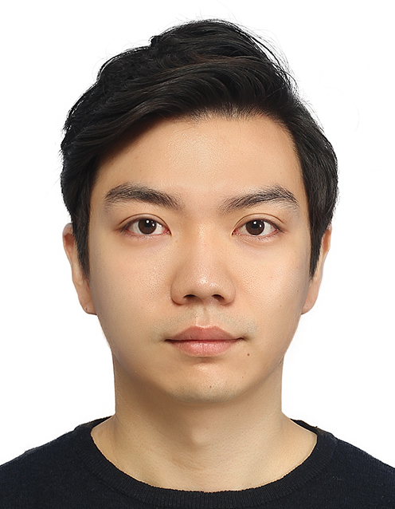

# Donghyeon Lee, Ph.D.


I'm a Staff Deep Learning Engineer in Samsung Electronics. 
At current, I'm on research and development on deep learning-based image processing algorithms such as demosaicing and super-resolution.
Before joining Samsung Electronics in 2019, I received a Ph.D. degree in Electrical and Computer Engineering from Seoul National University
I received a B.S. degree in Electronic Engineering from Sogang University.
I have domain knowledge not only of deep learning-based algorithms but also in designing hardware accelerators. 
My research interests include deep learning-based computer vision, object detection and tracking, and image compression.  
Please contact me for a detailed CV.

## Contact & Personal Information

E-mail: [donghyeon1223@gmail.com](mailto:donghyeon1223@gmail.com)  
Google Scholar: [link](https://scholar.google.com/citations?user=ysXHUKcAAAAJ&hl=en)  
LinkedIn: [https://www.linkedin.com/in/dhyeonlee/](https://www.linkedin.com/in/dhyeonlee/)  
GitHub: [https://github.com/dhyeonlee](https://github.com/dhyeonlee)  

## Educations
**Seoul National University**, Seoul, Korea - **_Ph.D._** in Electrical and Computer Engineering (Mar. 2021 - Feb. 2019)  
**Sogang University**, Seoul, Korea, - **_B.S._** in Electronic Engineering (Mar. 2008 - Feb. 2012)

## Experiences on Research & Development
**Samsung Electronics**, Hwaseong-si, Gyeonggi-do, South Korea - **_Staff Engineer_** (Mar. 2019 - Present)  
Multimedia Developmen team, System LSI division
- Prototyping algorithms in Samsung Exynos ISP (Image Signal Processor) with lightweight CNNs
    - Demosaicing: largely improved the performance of recovering details, eliminating zipper artifacts, and
color moiré in subjective assessment.
    - Super-resolution: improved subjective quality of images by a large margin

**Seoul National University**, Seoul, South Korea - **_Ph.D. student_** (Mar. 2012 - Feb. 2019)  
Computer Architecture and Parallel Processing Lab. (Advisor: [Prof. Hyuk-Jae Lee](mailto:hjlee@capp.snu.ac.kr))

- Deep learning-based image super-resolution algorithm and its hardware implementation  
    (Participated as a **Project leader**, Mar. 2017 - Feb. 2019, Sponsored by **LG Display**)
    - Hardware design of 1D filter CNN: reduced the number of parameters of a CNN to 55.6%  
    Publications: JETCAS '19, AICAS '19
    - Image enhancement using GANs: improved image quality (PSNR 0.75 dB (×2), 0.32 dB (×4)) through modifications of discriminator network architecture and perceptual loss  
    Publication: Access '19

- Real-time hand detection and tracking algorithms for embedded system  
    (Participaed as a **Project leader**, Mar. 2014 - Feb. 2017, Sponsored by Hancom MDS, eWBM)
    - Custom feature extraction and object analysis in the raster scan order. The hand detection accuracy of this algorithm is 97.11%. It runs in real-time (34.9 fps) on Nvidia Jetson-TK1 embedded board.  
    Publication: Displays '18; Demo at CES '17 Eureka Park

- Lightweight image compression for timing controller (T-CON) chip in LCD  
    (Mar. 2012 - Feb. 2014, Sponsored by LG Display)
    - Image compression for LCD overdrive with compression ratio 1/12  
    Publication: JDT '16
    - Visually lossless 1/3 image compression for a low-power LCD panel  
    Publications: TMM '16, Displays '15

## Awards

- Runner-Up Award (3rd). NTIRE Challenge 2021 Image Deblurring Challenge Track 2 JPEG Artifacts (Team: CAPP_OB, in **CVPR 2021**, Jun. 2021, [GitHub](https://github.com/dhyeonlee/WRCAN-PyTorch), [Certificate](https://drive.google.com/file/d/1HHldJREFwTjQPT5K2Wy1a3lSy2t7lV-j/view?usp=sharing))


## Publications

### Journal and Conference articles

- **Donghyeon Lee**, Chulhee Lee, and Taesung Kim, “Wide Receptive Field and Channel Attention Network for JPEG Compressed Image Deblurring”, IEEE/CVF CVPR Workshops, Jun. 2021.
- **Donghyeon Lee**, Hoseong Lee, Sangheon Lee, Kyujoong Lee, and Hyuk-Jae Lee, “Hardware Design of a Context-Preserving Filter-Reorganized CNN for Super-resolution”, IEEE JETCAS, Dec. 2019.
- **Donghyeon Lee**, Sangheon Lee, Hoseong Lee, Kyujoong Lee, and Hyuk-Jae Lee, “Resolution-Preserving Generative Adversarial Networks for Image Enhancement”, IEEE Access, Aug. 2019
- **Donghyeon Lee**, Sangheon Lee, Hoseong Lee, Kyujoong Lee, and Hyuk-Jae Lee, “Context-Preserving Filter Reorganization for VDSR-Based Super-resolution," IEEE AICAS, Mar. 2019. 
- **Donghyeon Lee**, Jin-Sung Kim, and Hyuk-Jae Lee, “Fast hand and finger detection algorithm for interaction on Smart Display”, Elsevier Displays Journal, Dec. 2018.
- Hyukeun Lee, **Donghyeon Lee**, and Hyuk-Jae Lee, "A Predictive Initialization of Hidden State Parameters in a Hidden Markov Model for Hand Gesture Recognition", IEEE ICCE-Asia, Jun. 2018.
- **Donghyeon Lee**, Hoseong Lee, Kyujoong Lee, and Hyuk-Jae Lee, "Fast Very Deep Convolutional Neural Network with Deconvolution for Super-Resolution", Journal of Korea Multimedia Society, 2017.
- Sunwoong Kim, **Donghyeon Lee**, Jin-Sung Kim, and Hyuk-Jae Lee, "A Block Truncation Coding Algorithm and Hardware Implementation Targeting 1/12 Compression for LCD Overdrive", IEEE/OSA JDT, Apr. 2016.
- Sunwoong Kim, **Donghyeon Lee**, Jin-Sung Kim, and Hyuk-Jae Lee, "A High-Throughput Hardware Design of a One-Dimensional SPIHT Algorithm," IEEE TMM, Mar. 2016.
- Sunwoong Kim, **Donghyeon Lee**, Hyun Kim, Nguyen Xuan Truong, and Jin-Sung Kim, "An enhanced one-dimensional SPIHT algorithm and its implementation for TV systems," Elsevier Displays Journal, Dec. 2015.

### Dissertion
**Donghyeon Lee**, “On-chip memory reduction in CNN hardware design for image super-resolution”, Ph.D. Dissertation, Seoul National University, Feb. 2019.


<!-- ## Welcome to GitHub Pages

You can use the [editor on GitHub](https://github.com/dhyeonlee/dhyeonlee.github.io/edit/main/README.md) to maintain and preview the content for your website in Markdown files.

Whenever you commit to this repository, GitHub Pages will run [Jekyll](https://jekyllrb.com/) to rebuild the pages in your site, from the content in your Markdown files.

### Markdown

Markdown is a lightweight and easy-to-use syntax for styling your writing. It includes conventions for

```markdown
Syntax highlighted code block

# Header 1
## Header 2
### Header 3

- Bulleted
- List

1. Numbered
2. List

**Bold** and _Italic_ and `Code` text

[Link](url) and 
```

For more details see [GitHub Flavored Markdown](https://guides.github.com/features/mastering-markdown/).

### Jekyll Themes

Your Pages site will use the layout and styles from the Jekyll theme you have selected in your [repository settings](https://github.com/dhyeonlee/dhyeonlee.github.io/settings/pages). The name of this theme is saved in the Jekyll `_config.yml` configuration file.

### Support or Contact

Having trouble with Pages? Check out our [documentation](https://docs.github.com/categories/github-pages-basics/) or [contact support](https://support.github.com/contact) and we’ll help you sort it out.
 -->
